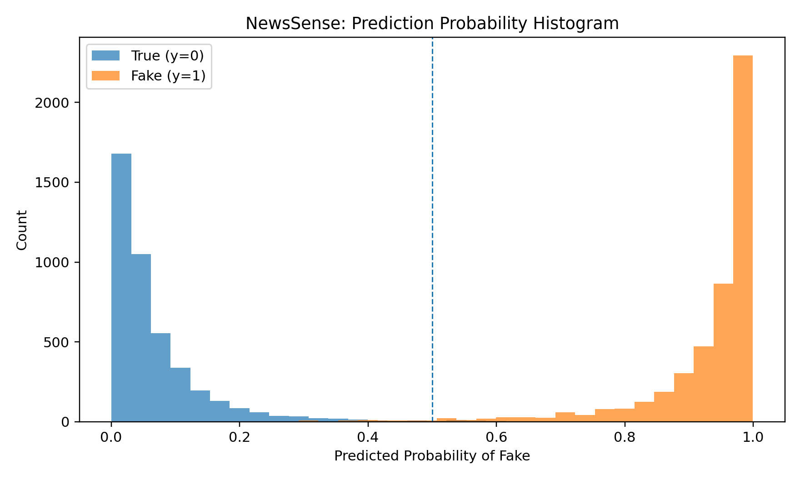

🌐 NewsSense — AI‑Powered Fake News Detector

NewsSense is an NLP project that detects whether a news item is Real (True) or Fake and explains model behavior with simple, interpretable visualizations.

It uses a TF‑IDF + Logistic Regression baseline (balanced for class imbalance) and includes utilities to:

convert datasets to multiple formats (PKL/H5/JSONL/YAML),

generate correlation heatmaps and accuracy curves,

train/evaluate and export predictions CSV + quality graphs (ROC/PR),

save a reusable trained model.

📁 Dataset Layout (local)

Place the two CSVs as follows:

C:\Users\sagni\Downloads\News Sense\archive\News _dataset\
├─ True.csv
└─ Fake.csv

Each file typically contains columns like title, text, subject, date.
The scripts add label automatically: 0 = True (real), 1 = Fake.

If storage on C: is tight, change any script’s OUT_DIR to another drive (e.g., D:\NewsSense).

🔧 Environment
pip install pandas numpy scikit-learn matplotlib joblib pyyaml tables

pyyaml and tables are optional but recommended (for YAML/HDF5).

Always use 64‑bit Python for HDF5 (PyTables).

🧰 Scripts

Save these files in C:\Users\sagni\Downloads\News Sense\ (or your repo root) and run with Python.

1) Convert dataset → PKL/H5/JSONL/YAML (space‑safe)

File: news_save_multi_formats.py
Creates multiple artifact formats and small metadata YAML.

Outputs (default):

C:\Users\sagni\Downloads\News Sense\
├─ news_dataset.pkl.gz           # compressed pickle
├─ news_dataset.h5               # HDF5 (chunked/compressed; best effort)
├─ news_dataset.jsonl            # streaming JSON Lines
├─ news_dataset.yaml             # subset (configurable)
└─ news_dataset_meta.yaml        # schema + class balance

Run:

python news_save_multi_formats.py

Tips

If you see “No space left on device”, move OUT_DIR to a larger drive.

If HDF5 complains about long strings, the script already computes per‑column min_itemsize. As a last resort you can truncate very long text fields for HDF5 only.

2) Heatmap + Accuracy Curve

File: news_heatmap_and_accuracy.py
Builds simple numeric features (length, punctuation, URL count, uppercase ratio), plots a correlation heatmap, and trains an SGD (logistic) model to produce an accuracy‑over‑epochs curve. Also saves a confusion matrix and a classification report.

Outputs:

C:\Users\sagni\Downloads\News Sense\
├─ news_features_corr_heatmap.png
├─ news_accuracy_over_epochs.png
├─ news_accuracy_over_epochs.csv
├─ news_confusion_matrix.png
├─ news_classification_report.txt
└─ news_heatmap_and_accuracy_meta.json

Run:

python news_heatmap_and_accuracy.py

3) Train → Predict → Export (full prediction pipeline)

File: news_train_and_predict.py
Trains TF‑IDF + Logistic Regression (balanced), evaluates on a stratified test split, and saves predictions + quality plots + trained model.

Outputs:

C:\Users\sagni\Downloads\News Sense\
├─ news_model.pkl
├─ news_test_predictions.csv
├─ news_metrics.json
├─ news_confusion_matrix.png
├─ news_roc_curve.png
└─ news_pr_curve.png

Run:

python news_train_and_predict.py

Predictions CSV columns

text_preview: truncated preview for quick inspection

y_true: 0 = True, 1 = Fake

prob_fake: predicted probability of Fake

y_pred: 0/1 final label with default threshold 0.5

✍️ Customize

Change output folder: edit OUT_DIR at the top of each script (e.g., Path(r"D:\NewsSense")).

Vectorizer options: adjust ngram_range, min_df, max_features in TfidfVectorizer.

Classifier: swap Logistic Regression for LinearSVC, SGDClassifier, or a transformer model later.

Thresholding: default decision threshold is 0.5. To emphasize recall on “Fake”, lower it (e.g., 0.3).

🐛 Troubleshooting

HDF5 “min_itemsize” / string length errors
The multi‑format script computes min_itemsize from real data. If extremely long fields still fail, truncate text for HDF5 only:

for col in ["title", "text"]:
    if col in df_h5.columns:
        df_h5[col] = df_h5[col].str.slice(0, 65000)

No space left on device
Use compressed formats (.pkl.gz, .jsonl) and/or change OUT_DIR to a larger drive.

Slow plotting on huge splits
Reduce epochs in the accuracy script or limit max features in TF‑IDF.

🧪 Quick Single‑Text Prediction (after training)

Once news_model.pkl exists, you can add this snippet anywhere:

import joblib
model = joblib.load(r"C:\Users\sagni\Downloads\News Sense\news_model.pkl")
label_map = {0: "True", 1: "Fake"}

txt = "Breaking!!! You won’t believe what happened…"
prob_fake = float(model.predict_proba([txt])[0, 1])
pred = 1 if prob_fake >= 0.5 else 0
print(label_map[pred], prob_fake)

📜 Ethics & Limitations

This baseline model is not a fact‑checker. It predicts patterns in text that correlate with “fake” vs “real” in the training data.

Always verify claims with reliable sources (e.g., fact‑checking organizations).

Avoid using the model to make sensitive or high‑stakes decisions without human review.
Author

SAGNIK PATRA
